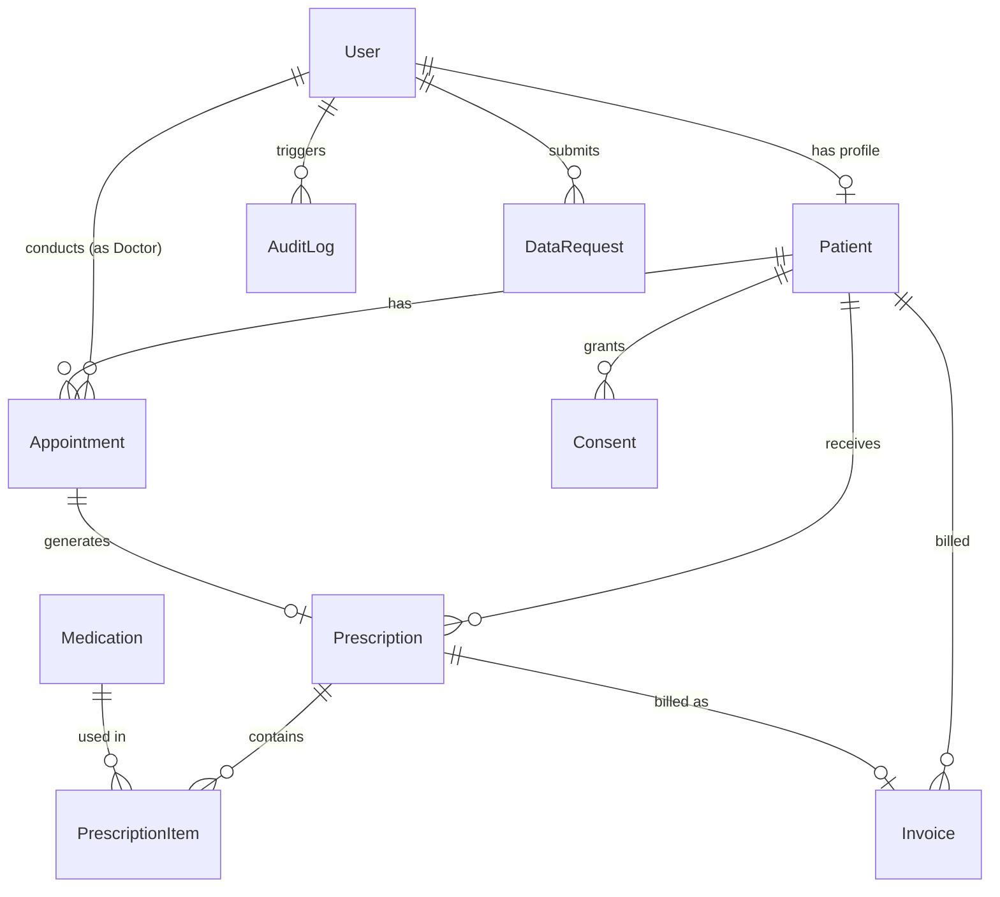

# Database Schema & Performance Indexing Guide

## 1. Relational Entity Overview

## 2. Performance Indexing Strategy

To maintain sub-50ms query latency as clinic records scale, explicit database indexes are applied:

| Model | Index Fields | Purpose |
| :--- | :--- | :--- |
| `Patient` | `nationalId` (Unique) | Instant patient identification lookup |
| `Patient` | `hn` (Unique) | Hospital Number quick search |
| `Appointment` | `scheduledAt, doctorId` (Composite) | Doctor daily schedule rendering |
| `Prescription` | `status` | Pharmacy dispensing queue filtering |
| `Medication` | `stockQuantity` | Low-stock inventory alert triggers |
| `Invoice` | `createdAt` | Financial reporting & daily revenue queries |
| `AuditLog` | `userId, createdAt` (Composite) | PDPA compliance history audit trail |

## 3. Database Connection Pooling

In production (Vercel serverless deployment), database connection exhaustion is mitigated using **PgBouncer**:
- `DATABASE_URL`: Set to PgBouncer pooled URL (Transaction mode, port 6543)
- `DIRECT_URL`: Set to direct PostgreSQL port 5432 for Prisma migrations
